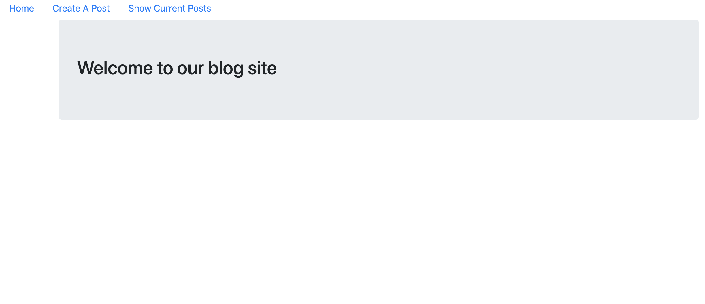
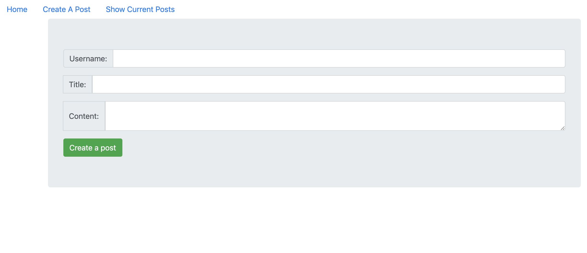
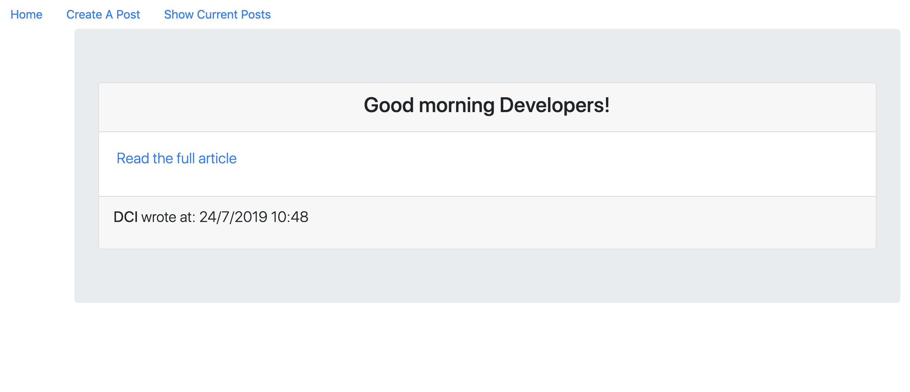

## Instructions for students:

### Create a Blog

Create a Blog, your blog should contain a welcome page, you should display the navigation bar at all times. The user should be able to create a post through the form on the /create route.
Once the user creates a post, they should be redirected to the /show route, which shows all the posts that were created. Every post should depict the information about who the author is, when the post was created, the title and the content of it.

-   Start the project with create react app.

-   Use different components and import them into the corresponding file. _Examples of components: app, home, showAllPosts, showSinglePost_

-   Use Lifecycle methods.

-   Use React Router.

-   See images for reference:
    
    
    

**Bonuses**

-   User should be able to also see a single post by clicking to read the full article.
-   Give the user the option to upload an image
-   Give the user the ability to edit and/or delete their post.

### Rules

-   This is an individual assignment.
-   Deadline: 3 Hrs.
-   Use **Git properly**
-   Feel free to document your code with comments.
